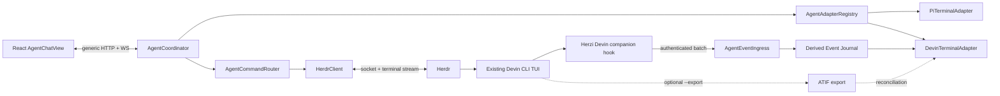

# Devin 接入调研与架构报告

> 日期：2026-09-15（Asia/Shanghai）
> 状态：方案完成，尚未实施
> 首期目标：Herdr 中已经运行的 Devin CLI Pane
> 体验目标：尽量与现有 Pi Chat 保持一致；公开稳定接口不能实现的差异必须明确展示并在实施前确认
> 证据范围：当前仓库代码与文档、Devin 官方文档与公开 CLI artifact、ACP 官方规范、Herdr 官方文档与公开源码；未读取用户 Devin 配置、真实会话数据库、真实 Pane 内容或私人 transcript。后续数据库专项调研仅在隔离 HOME/XDG 中生成并读取空白 synthetic DB，详见 [`devin-local-database-research.md`](./devin-local-database-research.md)

## 1. 执行结论

### 1.1 推荐方案

首期应采用 **terminal-backed Devin adapter + Devin companion hook journal**，而不是 Devin Cloud API，也不是由 Herzi 另起 `devin acp`：

1. Herdr 继续拥有 Pane、PTY 和唯一的 Devin CLI 运行时。
2. Herdr 官方 Devin integration 负责：
   - 识别 `agent=devin`；
   - 报告准确的 native session id；
   - 在 Herdr 重启后使用 `devin --resume <id>` 恢复；
   - 通过 screen manifest 判断 `idle / working / blocked`。
3. Herzi 新增独立 companion hook，采集 Devin 官方 hooks 提供的 user prompt、tool lifecycle、permission、stop/final answer 等事件，写入 Herzi 自有的受限事件 journal。
4. Herzi 把 journal 投影为与 Pi 共用的通用 Chat timeline；prompt 和 cancel 仍写回原 Pane。
5. Terminal 始终保留为完整、实时和交互兜底；不从 ANSI 画面猜 transcript，不并发 resume 同一 session。
6. 默认不依赖 Devin 未公开的 SQLite schema；数据库只能在独立 feature flag 下通过 SQLite Online Backup 一致性快照做实验性旧历史 bootstrap，schema 不匹配时必须 fail closed。
7. 对由 Herzi 主动创建的 Devin Pane，可选加 `--export <path>`，用 ATIF 导出补强完整历史；它不能作为“任意已有 Pane”的唯一依赖。

### 1.2 可行性判断

| 能力 | 首期判断 | 置信度 | 数据来源 |
| --- | --- | --- | --- |
| 识别 Devin Pane | 可实现 | 高 | Herdr process detection + Devin manifest |
| 准确 native session id | 可实现 | 高 | Herdr Devin integration v2 |
| Prompt 写回同一运行时 | 可实现 | 高 | Herdr `agent.prompt` |
| 工作/阻塞/完成状态 | 可实现，但依赖屏幕规则 | 中高 | Herdr screen manifest |
| Cancel 当前 turn | 可实现，需真实验证按键策略 | 中 | Devin `Ctrl+C` / `Esc Esc` + Herdr send keys |
| 当前集成安装后的 user/assistant turn | 可实现 | 中高 | `UserPromptSubmit` + `Stop.last_assistant_message`（后者需版本门槛验证） |
| Tool card 与结果 | 可实现为 derived/best-effort | 中 | `PreToolUse` / `PostToolUse` |
| 已有 session 的完整历史回填 | 公开接口无法保证；SQLite 快照可能补齐但尚未验证 | 低 | hook 不重放历史；内部 DB schema/message forest 无兼容承诺 |
| Assistant token streaming | terminal-backed 模式下无公开稳定接口 | 高 | Devin hook 无 message delta 事件 |
| Thinking streaming | terminal-backed 模式下无公开稳定接口 | 高 | Devin hook 无 reasoning delta 事件 |
| Chat 内结构化 approval/question | 不建议首期实现 | 高 | hook 可观察请求，但公开 hook 契约不足以安全完成响应闭环 |
| 图片原生 message | 无法通过 Herdr 文本 prompt 保证 | 中高 | 可先用受管 host path 降级 |
| Pi 式 branch/tree | 不等价 | 高 | Devin `/fork`、`/steps` 不是 Pi JSONL tree，hook 无完整分支事件 |

### 1.3 必须诚实说明的结论

在“**连接 Herdr 中已存在的交互式 Devin CLI**”这一前提下，当前公开稳定接口不能达到 Pi 的全部能力：

- Pi 有公开格式、可只读解析的 JSONL 历史和细粒度 extension events；Devin CLI 没有公开只读 transcript API。专项调研已确认当前 CLI 有本地 SQLite session DB，但其 path/schema/message JSON 均无第三方兼容承诺，只能作为实验性内部数据源。
- Devin hooks 没有 assistant token delta、thinking delta 或完整 history replay。
- ACP 能提供流式消息、工具、审批、取消和历史恢复，但 `devin acp` 是另一个由客户端启动和拥有的运行时，不是当前 Herdr TUI 进程的旁观接口。
- 同时运行 ACP 并 load/resume 正在 TUI 中打开的 session，可能触发 session lock、双运行时所有权或状态分叉；首期禁止这样做。
- Moshi 当前也没有为 Devin CLI 提供 Native Chat View：官方支持矩阵把 Devin 放在 Tier C（Terminal/TUI only），而不是 transcript-backed Tier A。这是公开产品对同一接口缺口的直接佐证。

因此，推荐把“与 Pi 一致”定义为 **一致的页面、消息模型、输入、停止、状态、工具卡和明确降级体验**，而不是虚假承诺完全相同的数据完整度与 streaming 粒度。

## 2. 已确认的需求与边界

用户已确认：

- 首期对象是 **Herdr 中的 Devin CLI**，不是 Devin Cloud session。
- 希望体验与 Pi agent 保持一致；困难项可以商议。
- 当前只实施 Devin，但架构必须支持后续 Codex 等 agent。

首期不应做：

- 不接入 Devin Cloud session 列表作为侧栏主资源。
- 不由 Herzi 启动第二个 Devin runtime 来“接管”已有 Pane。
- 默认链路不依赖、任何链路都不修改 Devin 未公开的本地 SQLite/内部 session 文件；若启用研究性 DB importer，只能从 SQLite Backup API 生成的 Herzi 私有一致性快照读取。
- 不把 Terminal ANSI 输出反向解析成权威 Chat transcript。
- 不为了表面一致而伪造 token streaming、tool id、approval result 或历史完整性。

## 3. 当前项目审计

### 3.1 当前结构

当前 Herzi 是本机 Node.js/Fastify + React Web 应用：

- Herdr 提供 workspace/tab/pane、agent 状态、prompt、send keys 和 Terminal observe/control。
- Pi Chat history 由 `PiSessionReader` 直接读取准确的 Pi JSONL path。
- Pi realtime bridge 通过 loopback HTTP 上报消息、tool、状态与分支事件。
- Web 端用 assistant-ui External Store 渲染 Pi Chat。

核心文件：

| 文件 | 当前职责 | 多 Agent 阻碍 |
| --- | --- | --- |
| `src/shared/protocol.ts` | Pane、Chat、Pi realtime 类型 | `PiBridge*` 与通用 Chat 类型混在一起；`hasChatSession` 过于笼统 |
| `src/server/herdr-client.ts` | Herdr snapshot 与 Pi path | 只缓存 `piSessionPaths`；丢弃了通用 `agent_session` 和 `terminal_id` |
| `src/server/index.ts` | HTTP/WS 路由与所有业务装配 | 多处 `pane.agent !== "pi"`；Pi upload/realtime/prompt/cancel 全部硬编码在入口文件 |
| `src/server/pi-session-reader.ts` | Pi JSONL → Chat projection | parser 与 Pi schema 强绑定，本身不应泛化，但应藏到 adapter 后面 |
| `src/server/pi-realtime.ts` | Pi live events | 应成为 Pi adapter 私有实现 |
| `src/web/App.tsx` | Pane 视图选择 | Chat 条件硬编码为 Pi |
| `src/web/components/ChatView.tsx` | Chat fetch、realtime merge、prompt/cancel | API、状态与 attachment 能力假设均偏 Pi |
| `integrations/pi/` | Pi companion extension | 说明项目已经验证“官方持久历史 + companion realtime”的模式，但 Devin 只能做到较弱版本 |

### 3.2 主要耦合点

当前不适合直接复制一个 `if (agent === "devin")` 分支，原因是：

1. `HerdrClient` 只暴露 `getPiSessionPath()`，没有通用 session ref。
2. `PaneSummary.hasChatSession` 把“有 Pi path”误当成“可显示 Chat”。
3. server 路由同时负责 adapter 选择、身份校验、投递、上传、realtime store 与 HTTP 序列化。
4. Web 端把“Pi 的数据完整度”当成所有 Chat 的默认能力。
5. Pi 的 `branchLeafId`、native image command 等概念不能平移到 Devin。

若直接增加条件分支，Codex 接入时会再次复制路由、状态合并和 UI 判断，最终形成 `pi/devin/codex` 三套互相漂移的实现。

## 4. Devin 可用接入面调研

### 4.1 Devin CLI 与 Devin Cloud 是两个产品面

Devin 官方明确区分：

- **Devin CLI**：本地 coding agent，直接使用本机文件与环境，交互式运行在 terminal。
- **Devin Cloud**：运行在 Cognition 管理 VM 中，提供 Playbooks、Secrets、Knowledge 等云能力。

本项目首期选择 Devin CLI。Cloud API 只能作为未来独立 provider，不能用来观察本地 Devin CLI 的当前 Pane。

### 4.2 Herdr 官方 Devin integration

Herdr 当前官方文档与公开源码确认：

- `herdr integration install devin` 安装 Devin hook。
- Unix 默认写入 Devin config 目录下的 `herdr-agent-state.sh` 并更新 `config.json`；Windows 使用 PowerShell 脚本。
- 官方 integration 当前标记 `HERDR_INTEGRATION_VERSION=2`。
- 它注册 `SessionStart`、`UserPromptSubmit`、`PreToolUse`、`PostToolUse`、`PermissionRequest`、`Stop`，但只用于刷新 native session identity。
- hook 优先读取事件中的 `session_id`；受控 fallback 执行 `devin list --format json`，按 working directory 找 session。
- 它向 Herdr 上报：
  - `source=herdr:devin`
  - `agent=devin`
  - `kind=id`
  - native session id
- Herdr 冷启动恢复时使用 `devin --resume <id>`。
- Devin lifecycle 不由 hook authoritatively 决定。Herdr 官方说明，Devin hook 无法覆盖 permission cancellation、用户 interrupt 等全部状态转换，因此仍用 screen manifest / OSC 做状态权威。

当前仓库内的 `docs/herdr-api-schema.json` 也包含 `devin` integration target、`pane.report_agent_session` 和通用 `agent_session` 字段。**本轮没有执行用户环境中的 `herdr integration status`，所以当前机器是否已安装 v2 尚未查证。**

### 4.3 Herdr 可直接复用的命令能力

Herdr 对 Devin 可提供：

- `agent.prompt`：向当前 agent 的真实 PTY 做 bracketed paste，并提交 Enter；若 agent 已 blocked，拒绝发送。
- `agent.send_keys`：发送 `esc`、`ctrl+c` 等逻辑按键。
- `agent.focus`：聚焦并更新 seen/done 语义。
- `agent.wait`：按 `idle/done/blocked/working` 等语义状态等待。
- `terminal session observe/control`：保持现有原始 TUI 视图与手动交互。

这意味着 identity、状态、输入、停止和 Terminal 都不需要重新实现 Devin 协议。

### 4.4 Devin 官方 hooks

Devin 官方 hooks 文档公开以下事件：

| Hook | 公开输入 | 可用于 Herzi |
| --- | --- | --- |
| `SessionStart` | `source` + 通用 `session_id` | 建立 session presence 与 identity |
| `UserPromptSubmit` | `prompt` | 确认 user message 已进入 runtime |
| `PreToolUse` | `tool_name`, `tool_input` | 创建 running tool card |
| `PostToolUse` | `tool_name`, `tool_input`, `tool_response` | 完成 tool card、显示结果/错误 |
| `PermissionRequest` | `tool_name`, `tool_input` | 显示 blocked/需要去 Terminal 处理 |
| `Stop` | `stop_hook_active` | turn 结束；新版 changelog 另说明包含 `last_assistant_message` |
| `PostCompaction` | `summary` | 可显示 compaction marker，不等价于完整 transcript |
| `SessionEnd` | `reason` | 结束 runtime presence |

每个 hook payload 还包含：

- `session_id`：session 级稳定 id；
- `prompt_id`：每个用户 turn 轮换的 id；首次 prompt 前事件可能没有。

限制：

1. hooks 没有 assistant message delta 或 reasoning delta。
2. `Stop.last_assistant_message` 来自官方 stable changelog，但当前 lifecycle hooks 页面尚未把它列入字段表；实现前必须对最低 Devin CLI 版本和真实 payload 做 fixture 验证。
3. 公开字段表没有承诺稳定的 tool call id。并行或重复的同名同参工具可能只能 best-effort 配对。
4. `PermissionRequest` hook 能返回 allow/block 决策，但把 hook 阻塞到浏览器响应会放大 timeout、掉线与双重审批风险；不适合直接当远程 approval RPC。
5. hook 事件不重放旧历史。

### 4.5 `--export` / ATIF

Devin CLI 官方命令包含：

```bash
devin --export [PATH] -- <prompt>
```

官方说明它会在每个 turn 后导出 conversation，格式为 ATIF；stable changelog 说明后续版本增加了更丰富的 step、telemetry 和 timing 字段。

可用价值：

- 对 **由 Herzi 主动启动且显式带 `--export` 的 Devin Pane**，可以在每 turn 完成后重建较完整的历史。
- export 文件可作为 hook journal 的 reconciliation 来源，而不是 realtime 来源。

限制与未查证项：

- 官方 CLI 文档未给出 ATIF 的完整 schema/versioning contract。
- 未查证指定 path 时是覆盖写、原子替换还是增量写；必须用 synthetic session 验证。
- 已经运行且启动时未传 `--export` 的 Pane 无法被无侵入补加参数。
- Herdr 默认 restore command 是 `devin --resume <id>`，不会自动保留 Herzi 自定义 export 参数，除非 Herzi/Herdr 增加显式 launch metadata。

所以 ATIF 只能是可选增强，不能作为首期唯一数据源。

### 4.6 ACP

Devin CLI 提供：

```bash
devin acp
```

ACP 是 JSON-RPC over stdio，能提供：

- `session/new/load/resume/prompt/cancel`；
- assistant message chunks；
- tool call/update、diff、plan；
- permission request、elicitation；
- image 等 capability negotiation；
- session 历史恢复。

官方 TypeScript SDK 是 `@agentclientprotocol/sdk`，Apache-2.0；本轮读取的上游 `main` package version 为 `1.4.0`。ACP v1 是 stable 入口，v2 仍是 experimental。

ACP 技术上最接近 Pi extension 的体验，但它要求 Herzi 成为 client 并启动 `devin acp` 子进程。它不提供“旁观已经在另一个 PTY 中运行的 Devin TUI”的接口。因此：

- **不用于首期已有 Herdr Pane**；
- 可作为未来 `ownership=runtime-owned` 的第二种运行模式；
- 后续也可承载其他 ACP agent，但不能假定 Codex/其他 agent 都使用完全相同的扩展能力。

### 4.7 Devin Cloud API v3

当前推荐 API 是 v3 Organization API：

- `POST /v3/organizations/{org_id}/sessions`
- `GET /v3/organizations/{org_id}/sessions/{devin_id}`
- `GET/POST .../{devin_id}/messages`
- `DELETE .../{devin_id}`
- `POST .../{devin_id}/archive`
- attachment upload/list/download

认证使用 `cog_` 前缀的 service user API key 或 PAT。生产自动化推荐 service user + 最小 RBAC；本地个人工具可用 PAT。session 状态包括 `new/claimed/running/exit/error/suspended/resuming`，`status_detail` 包括 `working/waiting_for_user/waiting_for_approval/finished` 及额度/错误原因。

但当前 session message API 返回的主要结构只有 `event_id / created_at / source / message`，官方 common flow 要求轮询；本轮没有在官方 session API 索引中找到 webhook 或 token/tool streaming endpoint。Cloud API 适合未来独立 Cloud provider，不满足当前 local Pane 目标。

### 4.8 Moshi 的实际做法，以及 Devin 为什么不在 Chat View

Moshi 官方文档把 terminal-backed Chat View 的链路说明得很清楚：

1. `moshi-hook`/gateway 从 tmux 或 Herdr Pane 识别 agent 和该 Pane 的 native session id。
2. hook 的主要作用是建立 `pane -> agent -> exact session/transcript` 映射；完整 transcript **不是**由 hook event 拼出来的。
3. host gateway 根据准确 session id 找到 agent 自己的本地 transcript。
4. `/v1/transcripts` WebSocket 先发送 `backlog`，随后在完整 JSONL row 写入时发送 `append`。
5. app 端的 agent-specific parser 把原始 transcript row 转成 message、tool card、plan、question、image 和 recap。
6. prompt 与支持的 approval action 通过 tmux/Herdr 写回同一个 live terminal session。
7. gateway 只监听 `127.0.0.1:24543`，手机经已有 SSH connection 做端口转发；完整 transcript 不经过 Moshi backend。

这与 Herzi 当前 Pi 方案高度一致：**exact identity + agent-native persistent transcript + parser + multiplexer write-back**。Moshi 也明确拒绝按最新 mtime 猜 transcript。

但是，Moshi 当前官方支持矩阵中：

- Tier A Native Chat View：Claude Code、Codex CLI、OpenCode、Cursor、Kimi、Grok Build、Pi、OMP、Hermes；
- Devin CLI：只在 Tier C，即普通 Terminal/TUI compatibility；
- Tier C 不承诺 managed hook、session detection、transcript parsing、model/slash command discovery 或 native resume。

`/v1/transcripts` 的官方调试文档列出的 source 同样不包含 Devin。结论是：**Moshi 并没有找到一个公开、稳定的 Devin local transcript 接法；它对 Devin 的现状也是只提供终端。**

这对本方案有两个影响：

- “读取 Devin 原生 transcript 并做到 Pi 等价”不能作为首期可行假设。
- 本报告提出的 companion hook journal 是 Herzi 自己构建的 derived history，能力弱于 Moshi 对 Tier A agent 的 native transcript 模式，也比 Moshi 当前 Devin 支持更激进；必须先通过 P0 验证，UI 必须如实标记 partial/derived。

如果未来 Devin 公开只读 transcript、稳定 ATIF watcher 或 TUI observer API，应立即把 journal 降为 realtime hint，并像 Moshi 一样让 agent-native transcript 成为历史 authority。

## 5. 方案比较

| 方案 | 已有 Herdr Pane | 历史 | Streaming | Tool/approval | 风险 | 结论 |
| --- | --- | --- | --- | --- | --- | --- |
| SQLite Online Backup 快照 + 版本化 parser | 是 | 可能补齐旧历史，完整度待 synthetic 验证 | 取决于 commit 时机，不视为 streaming | 可能丰富 | 未公开 schema、message forest、迁移与隐私风险 | **仅实验性 bootstrap；不作默认 authority** |
| 直接查询/copy live Devin DB | 是 | 可能完整 | 不可靠 | 可能丰富 | WAL、一致性、锁、迁移及源目录副作用 | 拒绝 |
| 解析 Terminal ANSI | 是 | 仅 scrollback | 看似实时 | 不可靠 | 重绘、主题、宽度、TUI 版本导致误判 | 拒绝作为 Chat authority |
| 官方 hooks + Herzi journal | 是 | 安装后完整度中等 | tool 实时、assistant turn 末 | approval 只提示 | 无 token delta；tool 配对需验证 | **首期推荐** |
| `--export` ATIF watcher | 仅启动时启用 | turn 末可能较完整 | 否 | 取决于 schema | opt-in、schema 未充分公开 | 推荐作为增强 |
| `devin acp` | 否，另起 runtime | 完整能力最好 | 是 | 是 | 改变 ownership 与资源模型 | 未来 runtime-owned 模式 |
| Devin Cloud API | 否，云 session | flat messages | 轮询 | 受 API 限制 | 网络、RBAC、费用、非本地 Pane | 未来 cloud provider |

## 6. 推荐通用架构

### 6.1 两类 ownership 必须先建模

未来多 Agent 不能只按品牌区分，还要按运行时 ownership 区分：

```text
terminal-backed
  Herdr owns PTY + existing agent runtime
  examples: current Pi, first-phase Devin, future existing Codex TUI

runtime-owned
  Herzi starts and owns a structured protocol process
  examples: future devin acp, future codex app-server / SDK

remote-api
  provider owns remote runtime
  examples: future Devin Cloud API, Codex cloud
```

首期只实施 `terminal-backed/devin`，但接口不能排除后两类。

### 6.2 组件图



### 6.3 通用领域模型

建议把 UI 模型从 `ChatSnapshot` 演进为 `AgentConversationSnapshot`：

```ts
type AgentOwnership = "terminal-backed" | "runtime-owned" | "remote-api";
type Consistency = "authoritative" | "reconciled" | "derived" | "partial";

interface AgentSessionRef {
  agent: string;
  source: string;
  kind: "id" | "path";
  value: string;
}

interface AgentCapabilities {
  history: "none" | "since-integration" | "complete";
  assistantStreaming: "none" | "turn-final" | "token";
  tools: "none" | "summary" | "lifecycle";
  interactions: "terminal-only" | "structured";
  attachments: "none" | "host-path" | "native";
  cancel: "none" | "keys" | "native";
  branches: "none" | "markers" | "tree";
}

interface AgentConversationSnapshot {
  sessionKey: string;
  paneId: string;
  agent: string;
  ownership: AgentOwnership;
  consistency: Consistency;
  capabilities: AgentCapabilities;
  running: boolean;
  revision: number;
  messages: AgentMessage[];
  notices: AgentNotice[];
}
```

`AgentMessage.content` 继续复用现有 text/reasoning/image/tool-call，并逐步增加：

- `tool-result`
- `plan`
- `diff`
- `interaction`
- `notice`

UI 必须按 capabilities 显示真实能力。例如 Devin 首期显示“回复将在本轮结束后出现”，而不是保留一个永远不增长的 streaming bubble。

### 6.4 Adapter 接口

```ts
interface AgentAdapter {
  readonly kind: string;
  match(context: AgentPaneContext): boolean;
  capabilities(context: AgentPaneContext): AgentCapabilities;
  read(context: AgentPaneContext): Promise<AgentConversationSnapshot>;
  prompt(context: AgentPaneContext, input: AgentPrompt): Promise<DeliveryReceipt>;
  cancel(context: AgentPaneContext): Promise<CancelReceipt>;
  markSeen?(context: AgentPaneContext): Promise<void>;
  dispose?(sessionKey: string): Promise<void>;
}
```

关键设计：

- adapter 接受完整 `AgentPaneContext`，包括 server identity、pane id、terminal id、cwd、agent status、通用 session ref。
- browser 不发送 provider、本地 path 或 session id 来选择 adapter；server 根据最新 Herdr snapshot 选择，避免跨 session 注入。
- Pi reader/realtime/command queue 保持 Pi 私有，不强行泛化其 JSONL branch 语义。
- 通用 coordinator 只处理选择、snapshot/event envelope、revision、错误与 capability。

### 6.5 Session identity

建议内部 key：

```text
sha256(serverInstanceId + agent + sessionRef.source + sessionRef.kind + sessionRef.value)
```

说明：

- 不能只用 pane id；Pane 可以移动、关闭或被新进程复用。
- 不能只用 cwd；同一目录可以有多个 Devin session。
- 不能按 `devin list` 的“最近 session”猜测。
- 前端只收到 opaque `sessionKey`，不收到 host path 或 credential。
- Devin 官方 Herdr hook上报 exact session id 后才启用 derived Chat；此前只提供 Terminal 与 composer。

## 7. Devin companion bridge 设计

### 7.1 安装原则

- 不修改 Herdr 管理的 `herdr-agent-state.sh`；Herdr 明确说明更新 integration 会覆盖该文件。
- Herzi 使用独立脚本，例如 `herzi-agent-events`，作为同一 Devin hook event 下的第二个 command handler。
- installer 只增删带稳定 marker/id 的 Herzi entries，保留用户其他 hooks。
- 安装前备份并解析 `config.json`；解析失败时 fail closed，不覆盖文件。
- 提供 `status/install/uninstall/doctor`，并显示最低 Devin CLI / Herdr integration 条件。
- 安装是显式用户动作，不能随 Herzi 启动静默改用户配置。

### 7.2 事件 envelope

```ts
interface DevinHookEnvelope {
  protocol: 1;
  eventId: string;
  paneId: string;
  sessionId: string;
  promptId: string | null;
  hookEvent: string;
  emittedAt: number;
  sequence: number;
  payload: unknown;
}
```

要求：

- `eventId` 幂等；server 重收不能生成重复消息。
- `sequence` 由 helper 在 session 级私有 state 中带文件锁递增，不能仅使用到达顺序。
- helper 对正文和 tool output 设置单事件/单 turn 上限；超限写截断 marker。
- hook handler 最长等待建议小于 500 ms；网络/Herzi 不可用时不影响 Devin。
- event journal 是 append-only derived store，默认目录权限 `0700`、文件 `0600`。
- spool 有总量上限和按 session rotation；超过上限丢最旧 derived 事件并写 `resync-required`。
- server 普通日志只记录 event type、size、sessionKey hash 和错误码，不记录 prompt、tool input/output 或绝对路径。

### 7.3 身份校验与认证

当前 Pi ingress 主要依赖 pane/path identity。Devin 只有 session id，因此新 bridge 应更严格：

1. helper 只在 `HERDR_ENV=1` 且有 `HERDR_PANE_ID` 时启用。
2. request 带安装时生成的高熵 integration token；token 存储在用户私有 state/config 中，不进入 repo。
3. server 校验 bearer/HMAC 后，再用最新 Herdr snapshot 检查：
   - pane 仍存在；
   - `pane.agent === "devin"`；
   - `agent_session.kind === "id"`；
   - `agent_session.value === envelope.sessionId`。
4. 首次 hook 比 Herdr official hook 更早到达时，可以短暂 refresh/retry，但不能仅凭 payload 建立身份。
5. 失败返回 401/409；helper spool 后快速退出，不阻塞 Devin。

建议把 Pi 和 Devin ingress 后续统一迁移到同一 authenticated integration gateway。

### 7.4 Hook → Timeline 映射

| Hook | Timeline 动作 | 可靠度 | 处理规则 |
| --- | --- | --- | --- |
| `SessionStart` | session marker/presence | 高 | 不生成普通 message |
| `UserPromptSubmit` | user message persisted/confirmed | 高 | 按 `prompt_id` 与 optimistic bubble 合并 |
| `PreToolUse` | tool running | 中 | 优先使用真实 tool id；没有则 helper 生成局部 id |
| `PostToolUse` | tool complete/error | 中 | 真实 id 不存在时按 prompt + input hash + FIFO best-effort 配对；不确定则生成独立 result card |
| `PermissionRequest` | interaction notice | 中高 | 显示“需要在 Terminal 处理”，不自动回答 |
| `Stop` | assistant final + turn complete | 中高 | 只有字段存在且非空才生成 assistant message；按内容 hash 防重 |
| `PostCompaction` | compaction notice | 中 | 不把 summary 冒充 assistant 回复 |
| `SessionEnd` | runtime ended marker | 高 | 不删除 journal |

### 7.5 Projection 与去重

Devin timeline 使用 `session_id + prompt_id` 作为 turn 主键：

```text
optimistic user message
  -> UserPromptSubmit confirms
  -> zero or more tool start/result
  -> zero or more permission notices
  -> Stop final assistant
  -> turn settled
```

异常处理：

- 缺 `UserPromptSubmit` 但有 tool/Stop：创建 partial turn notice，不丢事件。
- `Stop` 重复：按 event id 和 `(promptId, finalContentHash)` 去重。
- hook 乱序：sequence 排序；已投影 revision 发生中间插入时发送 `replace`，不错误 append。
- helper/server 重启：从 journal 重建 snapshot。
- session id 改变：关闭旧 session store，不能把同 Pane 新 session 接在旧历史后。
- 无 `last_assistant_message`：只把 turn 标记 settled，并提示最终答复请看 Terminal。

### 7.6 ATIF reconciliation（可选增强）

只对 Herzi 创建并带 `--export` 的 Devin Pane启用：

1. export path 由 host 生成并与 pane launch ledger 绑定，不接受 browser 任意 path。
2. watcher 采用与 Pi reader 相同的安全原则：完整文件、size/identity/fingerprint、atomic replace、poll reconciliation。
3. parser 对未知字段保留，按 schema/version capability 降级。
4. ATIF 是 turn-end reconciliation；hook 仍负责低延迟 tool/status。
5. export 与 hook 冲突时，ATIF 只在能稳定匹配 session/prompt/step 时替换 derived block；否则并列 diagnostic，不静默覆盖。

实施前必须先获得 synthetic ATIF fixtures。没有 fixture 时不开发猜测性 parser。

## 8. Prompt、Cancel、附件与交互

### 8.1 Prompt

通用 `AgentCommandRouter` 调用 Devin adapter：

1. 从最新 Herdr snapshot 校验 Pane 仍是 Devin、session ref 未变化。
2. `agentStatus === blocked` 时拒绝普通 prompt，并提示切换 Terminal。
3. 调用 Herdr `agent.prompt { target: pane.id, text }`。
4. 返回 `submitted`，不是 `persisted`。
5. 前端生成 optimistic user bubble；收到 `UserPromptSubmit` 后确认。
6. 超时未收到 hook 证据时标记 `delivery-unconfirmed`，不自动重发。

Devin CLI 支持 working 时排队/引导消息，但具体 TUI 行为会随版本变化；首期沿用 Herdr `agent.prompt`，不自行推断是 queue、steer 还是立即 interrupt。

### 8.2 Cancel

Devin 官方当前说明：

- `Ctrl+C` 可在第一次按下时 interrupt；
- `Esc` 连按两次（3 秒内）也可 interrupt。

建议 adapter 策略：

- `working`：首选发送 `ctrl+c`，随后等待 Herdr 状态离开 working；
- `blocked`：发送 `esc` 关闭当前 permission/question UI；
- `idle/done`：返回 no-active-turn，不发送按键；
- 若真实冒烟证明 `ctrl+c` 会退出当前版本进程，则改为带 100–250 ms 间隔的两次 `esc`。

最终策略必须通过专用 Devin Pane 验证，不能只靠文档推断。

### 8.3 图片与文件

首期能力声明为 `attachments=host-path`：

- 复用现有 UploadStore 的 MIME、大小、像素、hash、权限和 Pane/session ledger。
- 将受管文件 path 作为明确附件 block 附到文本 prompt。
- Devin 通过本地 read/tool 自行读取；这不等价于模型原生 image content。
- UI 显示“通过本机文件路径发送”，不要标记为 native image。

原生图片需要 ACP prompt image capability 或 Devin 新的 TUI/runtime API；当前 terminal-backed 接口没有已查证的结构化 image message 方法。

### 8.4 Approval 与提问

首期 `interactions=terminal-only`：

- Chat 显示 Herdr blocked 状态和 hook 的 tool 摘要。
- 提供“一键切换到同一 Pane Terminal”。
- 不在 Chat 中提供看似可用但无法安全回送的 Allow/Reject 按钮。

如果“Chat 内完整审批/提问”被提升为硬要求，需二选一：

1. 与 Cognition/Devin 上游确认新的稳定 hook response/correlation 契约；或
2. 对新 session 改用 Herzi-owned `devin acp`，接受它不是已有 Herdr TUI Pane。

## 9. Server 与 Web API 演进

### 9.1 保持兼容的路由

建议先保留现有 URL，泛化语义：

- `GET /api/panes/:paneId/chat`：由 registry 选择 adapter。
- `POST /api/panes/:paneId/prompt`：通用 prompt；adapter 自行选择 transport。
- `POST /api/panes/:paneId/cancel`：通用 cancel。
- `POST /api/panes/:paneId/seen`：已有通用逻辑继续使用。
- `GET /api/panes/:paneId/chat/capabilities`：也可以直接合并到 snapshot，减少请求。
- `POST /api/integrations/devin/events`：authenticated batch ingest。

Pi bridge 的 `/api/integrations/pi/*` 暂时保留，后续再迁移，避免一次改动同时破坏已完成链路。

### 9.2 WebSocket

把 Pi 专用：

```json
{"channel":"chat","type":"realtime","paneId":"...","payload":{}}
```

演进为：

```json
{
  "channel": "agent",
  "type": "conversation.update",
  "paneId": "opaque",
  "sessionKey": "opaque",
  "revision": 42,
  "mode": "append",
  "payload": {}
}
```

规则：

- revision 缺口必须重新 GET snapshot。
- sessionKey 变化时客户端清空旧 optimistic/live state。
- `replace` 优先正确性，`append/update` 只作优化。
- 慢客户端丢事件并 resync，不能无限积压。

### 9.3 Pane 模型

`PaneSummary` 应增加：

- `terminalId`
- `agentSession: { source, agent, kind, value } | null`
- `chatAvailability: "none" | "partial" | "full"`
- `agentCapabilities` 或精简 capability summary

淘汰把 Pi path 推导成 `hasChatSession` 的做法。浏览器可以知道“Devin Chat 只从 integration 安装后开始”，但不应收到 native session id 的原值。

## 10. 建议目录结构

```text
src/server/agents/
  types.ts
  registry.ts
  coordinator.ts
  command-router.ts
  event-ingress.ts
  session-key.ts
  pi/
    adapter.ts
    transcript-reader.ts
    realtime-store.ts
    command-queue.ts
  devin/
    adapter.ts
    event-schema.ts
    event-journal.ts
    projector.ts
    atif-reader.ts          # 可选阶段
    installer.ts            # 显式调用，不在启动时自动运行
src/shared/
  protocol.ts
integrations/devin/
  package.json              # 如需 package 化
  bin/herzi-devin-hook.mjs
  fixtures/                 # 仅 synthetic、脱敏 fixture
src/web/components/
  AgentChatView.tsx
  ChatAttachments.tsx
```

第一轮可以移动/重命名最少文件，避免大爆炸重构；关键是先建立 adapter 边界和 contract tests。

## 11. 错误与降级语义

| 情况 | 能力/错误码 | UI 行为 |
| --- | --- | --- |
| Devin 已识别但无 session id | `identity-pending` | Chat 空态 + Terminal 可用；prompt 可发，等待 hook |
| Herdr Devin integration 未安装/过期 | `integration-missing` | 指向显式安装步骤，不自动修改配置 |
| Herzi companion 未安装 | `history=none` | 状态、prompt、cancel 可用；内容看 Terminal |
| companion 安装后无旧历史 | `history=since-integration` | 显示明确起始提示 |
| Stop 无 final message | `assistant-final-unavailable` | turn settled，但提示在 Terminal 查看答案 |
| tool 无可配对 id | `tool-correlation-uncertain` | 独立结果卡/diagnostic，不错误合并 |
| blocked | `interaction-terminal-only` | 显示切 Terminal CTA |
| hook ingress 断线 | `live-degraded` | 从 spool/journal 恢复；Terminal 不受影响 |
| session id 改变 | `session-replaced` | 清空 live state并加载新 session journal |
| prompt 写入成功但 hook 无证据 | `delivery-unconfirmed` | 不重发，提示检查 Terminal |
| event schema 新版本 | `unsupported-event-version` | 保存有限 metadata、忽略未知正文投影，不让整个 Chat 崩溃 |

## 12. 安全、隐私与运行约束

1. **单运行时**：绝不对活跃 TUI session 调用第二个 resume/load runtime。
2. **最小文件权限**：journal/spool/token 目录 `0700`，内容文件 `0600`。
3. **无正文日志**：Fastify、hook helper 与测试日志不得打印 prompt、tool output、credential、绝对 path。
4. **身份双校验**：integration token + Herdr pane/session ref；仅有 pane id 不够。
5. **输入上限**：prompt、hook JSON、tool input/output、单 session journal、WS queue 均设硬上限。
6. **不执行 hook payload**：tool name/input 只作为数据；不得拼 shell、eval 或当文件 path 自动读取。
7. **配置变更可回滚**：installer 原子写、备份、只删除自身 marker；禁止覆盖其他 hooks。
8. **浏览器隔离**：沿用 request token、Origin/Host 检查；integration endpoint 不使用浏览器 token，而使用独立 integration credential。
9. **隐私设置**：提供“持久化 Devin derived history”开关与清除动作；默认保留期需产品确认。
10. **远程 Herdr**：hook/journal 必须运行在 agent 主机；未来 client 只拿归一化事件，不能要求远端路径在本地可读。

## 13. Pi 与 Devin 的职责对照

| 层 | Pi | Devin 首期 |
| --- | --- | --- |
| Identity | Herdr exact JSONL path | Herdr exact native session id |
| Persistent authority | Pi JSONL | 无公开 authority；Herzi derived journal |
| Realtime | Pi extension message/tool events | Devin lifecycle hooks，粒度更低 |
| Status | Herdr/Pi integration | Herdr screen manifest |
| Prompt | Herdr text / Pi native image command | Herdr text + host-path attachment |
| Cancel | `Esc` | `Ctrl+C` 或 `Esc Esc`，待实测 |
| Branch | JSONL tree + `session_tree` | 不支持 Pi 式 tree；仅可显示 marker |
| Recovery | JSONL rere读 + live reconcile | journal 重建；可选 ATIF reconcile |
| Structured approval | 当前仍多走 Terminal | Terminal-only |

这张表应作为 UI capability 提示和验收依据，不能隐藏差异。

## 14. 后续 Codex 适配方式

本报告没有为 Codex 做完整实施调研，但已核实两点：

1. Herdr 官方 Codex hook可以报告 exact session id，并用 `codex resume <id>` 恢复。
2. Codex 官方 `app-server` 是适合 rich client 的 JSON-RPC 接口，提供 thread read/list/resume、turn/item streaming、approval、interrupt 和 schema generation。

因此未来 Codex 同样有两种模式：

- `terminal-backed/codex`：旁观已有 Herdr Codex TUI，优先使用公开 thread read/JSONL 能力，但必须验证是否可对活跃 TUI 做真正 read-only 读取；不能直接假定 app-server 可安全 attach。
- `runtime-owned/codex`：Herzi 启动 `codex app-server`，获得完整结构化体验。

通用 adapter/capability/ownership 模型可以容纳两种模式，而不把 Devin hook 的局限强加给 Codex。

## 15. 未查证项与实施前验证门

以下信息本轮明确未查证，不能在代码中假设：

1. 当前用户机器的 Devin CLI 精确版本、是否已登录、是否已安装 Herdr Devin integration v2。
2. 当前 Devin `Stop` hook 真实 payload 是否稳定包含 `last_assistant_message`。
3. 当前 Devin tool hooks 是否包含未写入字段表的稳定 tool call id。
4. `--export PATH` 的文件写入/替换方式、默认 path、ATIF schema 与 session id 映射。
5. Herdr `agent.prompt` 在当前 Devin TUI working 状态下具体表现为 queue、steer 还是其他行为。
6. `Ctrl+C` 与 `Esc Esc` 在当前版本对 working、permission、question 三种状态的精确效果。
7. host-path 图片是否会被当前模型/permission mode可靠读取。
8. SQLite `message_nodes` 的当前 main-chain、fork/revert、compaction、tool 与 subagent 投影语义，以及实际 turn commit 时机。
9. 对 active Devin DB 使用 SQLite Online Backup 时的 busy/locking/latency，以及跨 CLI upgrade 的 schema compatibility gate。

必须先在专用、无敏感内容的 Devin Pane 中生成 synthetic fixtures，再进入主实现。数据库专项验证步骤见 [`devin-local-database-research.md`](./devin-local-database-research.md)。

## 16. 建议决策

实施前建议产品负责人确认以下默认值：

1. **接受首期无 assistant token streaming**；Chat 在 turn 结束时显示最终答复，实时过程看 Terminal/tool cards。
2. **接受已有 session 只显示 companion 安装后的 derived history**；由 Herzi 新建的 session 再用 `--export` 增强。
3. **Approval/question 首期在 Terminal 完成**，Chat 只提示和一键切换。
4. **附件首期使用受管 host path**，不标记为原生图片。
5. **允许 Herzi 在用户明确执行 install 时修改 Devin user config**，并提供完整 uninstall/rollback。
6. **journal 默认保留期**建议 30 天，也可选择 session 关闭后立即删除；该项涉及隐私，需要明确决定。

如果 1–3 任一项不能接受，则 terminal-backed Devin 无法达到要求，应改为 Herzi-owned ACP 模式，产品资源模型也要从“Herdr Pane”扩展到“Herzi Agent Session”。

## 17. 一手来源

访问日期均为 2026-09-15。

### Devin CLI

- 数据库专项调研：[`devin-local-database-research.md`](./devin-local-database-research.md)
- Quickstart：<https://docs.devin.ai/cli>
- Commands & Flags：<https://docs.devin.ai/cli/reference/commands>
- Hooks overview：<https://docs.devin.ai/cli/extensibility/hooks/overview>
- Lifecycle hooks：<https://docs.devin.ai/cli/extensibility/hooks/lifecycle-hooks>
- Configuration：<https://docs.devin.ai/cli/extensibility/configuration>
- Stable changelog：<https://docs.devin.ai/cli/changelog/stable>
- Current CLI manifest：<https://static.devin.ai/cli/current/manifest.json>
- SQLite WAL：<https://www.sqlite.org/wal.html>
- SQLite Online Backup API：<https://www.sqlite.org/backup.html>
- Zed / ACP integration：<https://docs.devin.ai/cli/acp/zed>

### Devin API

- API overview：<https://docs.devin.ai/api-reference/overview>
- Authentication：<https://docs.devin.ai/api-reference/authentication>
- Teams quickstart：<https://docs.devin.ai/api-reference/getting-started/teams-quickstart>
- Common flows：<https://docs.devin.ai/api-reference/common-flows>
- Create session：<https://docs.devin.ai/api-reference/v3/sessions/post-organizations-sessions>
- Get session：<https://docs.devin.ai/api-reference/v3/sessions/get-organizations-session>
- List messages：<https://docs.devin.ai/api-reference/v3/sessions/get-organizations-session-messages>
- Send message：<https://docs.devin.ai/api-reference/v3/sessions/post-organizations-sessions-messages>
- Terminate：<https://docs.devin.ai/api-reference/v3/sessions/delete-organizations-sessions>
- Attachments：<https://docs.devin.ai/api-reference/v3/attachments/post-organizations-attachments>
- Release notes：<https://docs.devin.ai/api-reference/release-notes>

### ACP

- Introduction：<https://agentclientprotocol.com/overview/introduction>
- Protocol overview：<https://agentclientprotocol.com/protocol/v1/overview>
- Prompt turn：<https://agentclientprotocol.com/protocol/v1/prompt-turn>
- Tool calls：<https://agentclientprotocol.com/protocol/v1/tool-calls>
- TypeScript SDK：<https://agentclientprotocol.com/libraries/typescript>
- SDK source（Apache-2.0）：<https://github.com/agentclientprotocol/typescript-sdk>

### Herdr

- Agents：<https://herdr.dev/docs/agents/>
- Integrations：<https://herdr.dev/docs/integrations/>
- Socket API：<https://herdr.dev/docs/socket-api/>
- CLI reference：<https://herdr.dev/docs/cli-reference/>
- Session state/restore：<https://herdr.dev/docs/session-state/>
- Devin integration script：<https://github.com/herdrdev/herdr/blob/master/src/integration/assets/devin/herdr-agent-state.sh>
- Devin detection manifest：<https://github.com/herdrdev/herdr/blob/master/src/detect/manifests/devin.toml>

### Future Codex reference

- Codex app-server：<https://developers.openai.com/codex/app-server>
- Herdr Codex integration script：<https://github.com/herdrdev/herdr/blob/master/src/integration/assets/codex/herdr-agent-state.sh>

### Moshi

- Chat View：<https://getmoshi.app/docs/chat-view>
- Hooks 与 agent support tiers：<https://getmoshi.app/docs/hooks>
- Debugging Chat View：<https://getmoshi.app/docs/debug-chat-view>
- Debugging gateway / transcript stream：<https://getmoshi.app/docs/debug-gateway>

## 18. 证据限制

- Devin CLI 是闭源分发。数据库专项调研检查了官方公开 artifact 的字符串和在隔离 HOME/XDG 下生成的空白 synthetic DB schema；这只能证明 `v3000.10.27` 的当前内部实现，不是上游兼容承诺，也没有含真实 turn 的 fixture。
- 没有使用用户 credential 调用 Devin API，也没有创建真实 Cloud session，因此没有实测 rate limit、费用或组织 RBAC。
- 没有读取用户 Devin config/真实 session DB，也没有运行 `herdr integration status`；本机安装状态未查证。
- ACP 能力来自官方 protocol 与 Devin CLI 文档，但没有在当前用户环境启动 `devin acp` 做握手。
- 工程排期见配套实施方案，是单名熟悉 TypeScript/React/Herdr 的工程师粗估，不是交付承诺。
