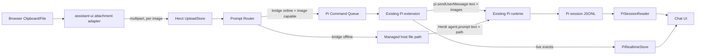

# Herzi 聊天框图片粘贴功能：调研与实现方案

> 日期：2026-09-15（Asia/Shanghai）
> 状态：首轮实现完成；bridge v2 已安装，待现有进程 reload 与真实浏览器/Pi 写入式验收
> 本地基线：Herzi `a2a2d17`；Pi `0.84.4`；`@assistant-ui/react` `0.15.17`；Herdr `0.8.2` / protocol 20
> 目标：用户在 Herzi Chat composer 中粘贴剪贴板图片，预览后随文本发送给当前 Herdr Pane 中已经运行的 Pi；不创建第二个 Pi runtime。

## 1. 执行摘要

功能可行，但不能只给 `<textarea>` 加一个 `paste` 监听器。当前链路的关键限制是：

- 浏览器和 assistant-ui 已有获取剪贴板图片、管理待发送附件的能力；
- Herzi 已能从 Pi JSONL 读取并显示图片；
- 但当前 Herzi composer、HTTP API 和 Herdr `agent.prompt` 都只发送文本；
- Herdr protocol 20 的 `agent.prompt` 只有 `target + text + wait`，没有二进制或图片字段；
- 当前 Herzi Pi companion extension 只有“Pi -> Herzi”的事件上报，没有“Herzi -> Pi”的命令通道；
- Pi 0.84.4 的 extension API 已提供 `pi.sendUserMessage()`，可以向**同一个正在运行的 Pi runtime**注入文本和 base64 图片。

因此推荐采用一个分层方案：

1. **前端统一附件体验**：粘贴、拖入或文件选择图片后，在 composer 中显示可删除缩略图；发送前不写宿主文件。
2. **首选原生图片通道**：Herzi Pi bridge 在线且当前模型支持图片时，通过新增的双向命令通道调用 `pi.sendUserMessage([{type:"text"}, {type:"image", data, mimeType}])`。图片作为 Pi user message 的正式 content 落入 JSONL，历史和模型输入都最准确。
3. **兼容路径通道**：bridge 未安装或离线时，把图片写入 Herzi 管理的宿主上传目录，再通过现有 Herdr `agent.prompt` 把“用户文本 + 受管图片路径”送入原 Pane。这与 Moshi 和 Pi TUI 自身的 Ctrl+V 图片流程一致。
4. **明确显示传输能力**：UI 区分“原生图片”与“文件路径兼容模式”；不把路径模式伪装成直接视觉输入。
5. **不采用危险捷径**：不修改 Pi JSONL、不另起 Pi RPC/SDK runtime、不改宿主系统剪贴板、不把 base64 塞进普通文本 prompt。

推荐实施顺序是先交付路径兼容模式，再把现有 companion bridge 升级为双向原生图片通道。这样 2–3 个工程日可得到可用版本，完整高保真方案约 6–10 个工程日。

## 2. 本报告所说的“图片粘贴”

### 2.1 首版支持范围

- 在 Herzi Chat composer 聚焦时，使用浏览器标准粘贴快捷键：macOS 为 `Cmd+V`，Windows/Linux 通常为 `Ctrl+V`；
- 处理剪贴板暴露为 `File` 的位图，例如系统截图和“复制图片”；
- 支持 PNG、JPEG、WebP、GIF；首版拒绝 SVG；
- 粘贴后先显示缩略图，可移除；允许“只有图片，没有文字”发送；
- 同一条消息最多 4 张图片；
- 图片随当前选中的 Pi Pane 发送，不能在切换 Pane 后串到另一个 session；
- 用户消息发送后立即乐观显示图片，随后与 Pi realtime/JSONL 权威消息收敛；
- bridge 不可用时自动降级为受管宿主路径，但 UI 必须说明当前是兼容模式。

### 2.2 不应误认为已支持的场景

浏览器粘贴事件不保证任何网页复制操作都会提供图片文件：

- 系统截图、Finder/Explorer 中复制图片、浏览器“复制图像”通常会提供 `image/*` 文件；
- 只提供 `text/html` 或远程 URL 的网页片段不应由 Herzi 自动下载，避免 SSRF、认证泄漏和跨域问题；
- 首版不支持 PDF、任意文档、文件夹、视频或音频；这些可在图片链路稳定后复用 attachment 框架扩展；
- 首版不承诺在移动浏览器中直接读取系统剪贴板。移动端应以文件选择器/相册选择作为可靠入口。

## 3. 当前项目审计

### 3.1 已经具备的基础

| 位置 | 已有能力 | 对本功能的价值 |
| --- | --- | --- |
| `src/server/pi-session-reader.ts` | 识别 Pi `{type:"image", data, mimeType}`，投影为 data URL | 原生图片进入 JSONL 后，历史读取基本已就绪 |
| `src/shared/protocol.ts` | `ChatPart` 已有 `{type:"image", image:string}` | 无需另造一套展示消息类型 |
| `src/web/components/ChatView.tsx` | assistant-ui External Store、乐观 user message、realtime/JSONL 合并 | 可扩展为文本 + 图片的乐观消息 |
| `integrations/pi/extensions/herzi-bridge.ts` | 已监听 message/tool/status/session 事件并批量上报 | 可以在同一个 extension 内增加下行命令，不需要第二个插件 |
| `src/server/index.ts` | 已按 Pane 校验 Pi 身份并通过 Herdr 定向发送 | 上传和命令也可绑定 opaque pane id |

### 3.2 当前阻断点

| 阻断点 | 代码事实 | 必须修改的原因 |
| --- | --- | --- |
| assistant-ui 未启用附件 | `useExternalStoreRuntime()` 没有 `adapters.attachments` | thread capability 的 `attachments` 为 false，`ComposerPrimitive.Input` 不会接收粘贴文件 |
| composer 只提取文本 | `onNew()` 只遍历 `message.content` 的 text part | 即便 UI 收到附件，也会在发送时被丢弃 |
| optimistic 层只支持文本 | `PendingUserMessage` 以规范化文本 occurrence 去重 | 相同文本搭配不同图片会错误收敛 |
| prompt API 只接文本 | `POST /api/panes/:paneId/prompt` body 为 `{text}` | 无上传 ID、MIME、hash 或投递状态 |
| Herdr 只支持文本 prompt | protocol 20 `AgentPromptParams.text` 为 string | 不能直接向该方法添加图片字段 |
| bridge 单向 | extension 只向 `/api/integrations/pi/events` POST | Herzi 无法调用现有 Pi runtime 的 `sendUserMessage()` |
| realtime 图片被降级 | bridge 的 `toChatParts()` 把 image 转成 `[image]` | 原生图片发送后，JSONL 落盘前不能作为权威图片事件使用 |
| 用户消息展示未明确附件 UI | `UserMessage` 主要渲染 text parts | 需要缩略图、预览、失败和移除交互 |
| Fastify 默认 body 限制偏小 | 当前没有 multipart 插件和上传资源预算 | 常见截图可能超过默认 JSON body 限制，不能直接塞入现有 JSON endpoint |

### 3.3 当前架构约束

图片功能必须继续遵守项目既有 ADR：

- Herdr 继续拥有 Pane、PTY 和已有 Pi 进程；
- Herzi 不能为同一 session 再启动 Pi SDK/RPC；
- exact `pane -> agent -> session path` 身份链仍是所有结构化能力的前提；
- JSONL 是持久权威，extension event 是低延迟补充；
- Terminal 始终保留为安全降级路径。

## 4. 参考实现调研

### 4.1 Moshi：宿主上传 + 路径回送

Moshi 的公开文档给出了最直接、也最适合 Herzi fallback 的模式：

1. 手机选择截图、照片、Clipboard 或文件；
2. Moshi 通过 SCP 把文件复制到 agent 主机的 `~/.moshi/uploads/`；
3. Chat mode 中把宿主本地路径附到 composer；Terminal mode 中直接把路径插入终端光标处；
4. prompt 仍回到同一 multiplexer/agent session；
5. 文件由用户从 Files 页面或宿主目录管理，不经过 Moshi 云端 transcript 通道。

Moshi Chat View 文档还明确写明 composer 可以 attach image，并且 Chat View 是现有 terminal/session 的视觉层，不启动第二个 agent。

可借鉴点：

- 路径是跨 terminal-backed agent 的最低公分母；
- 上传发生在 agent 所在主机，不能只存 GUI 客户端本地路径；
- Chat 与 Terminal 共享一个 session，附件不能另开 runtime；
- 不支持安全结构化映射时应明确降级。

不能从公开资料确认的部分：

- Moshi 客户端和 Pi 专用图片 adapter 源码未公开；
- 文档确认了产品行为，但不能据此断言其内部 Pi 图片最终一定以 JSONL image block 还是文本路径落盘。

### 4.2 Orca：composer 附件生命周期与断线恢复

Orca 当前 Native Chat 文档区分两类能力：

- terminal-backed Chat UI 在 host 支持时可以 attach file/image；
- updated local Codex structured chat 支持从 app menu/clipboard 粘贴图片，发送前显示可删除缩略图，可打开大图预览，并让未发送 draft text/attachments 随 Pane 跨断线恢复。

可借鉴点：

- 附件首先是 composer draft 状态，不应粘贴后立刻发送；
- 缩略图、移除、预览、上传失败恢复草稿属于完整体验的一部分；
- draft 必须绑定 Pane；切 Pane、重连和发送失败不能造成串消息或静默丢失；
- “terminal-backed 能否发送附件”应由 host/agent capability 决定，而不是全局开关。

边界：

- 2026-09-15 读取的 Orca `main` 中 terminal-backed native transcript agent 列表仍不包含 Pi；
- Orca 的 updated structured chat 是 Orca-owned Claude/Codex runtime，不应照搬到 Herzi 的 existing Pi Pane；
- Orca 可作为附件 UX 和生命周期参考，不是可直接复用的 Pi adapter。

### 4.3 Pi 0.84.4：两条图片输入路径

#### TUI Ctrl+V 路径

本机 Pi 0.84.4 README 说明 TUI 支持 Ctrl+V 粘贴图片和拖入图片。源码核查显示：

1. `readClipboardImage()` 读取宿主系统剪贴板；
2. 写入 `os.tmpdir()/pi-clipboard-<uuid>.<ext>`；
3. 把该临时文件路径插入 editor；
4. 用户提交后仍走普通文本 prompt；模型可通过 Pi 的 `read` tool 读取图片，`read` 会把处理后的图片作为 tool result image 发送给视觉模型。

这证明“上传到 agent 主机 + 发送路径”不是临时绕法，而是 Pi TUI 自己使用的兼容行为。

#### Extension 原生图片路径

Pi extension API 提供：

```ts
pi.sendUserMessage([
  { type: "text", text: "请分析这张图" },
  { type: "image", data: "<base64>", mimeType: "image/png" },
]);
```

它会在同一个 Pi runtime 内调用 prompt 流程，产生正式 user message，并把图片保存到 session JSONL。运行中可带 `deliverAs: "steer" | "followUp"`。

本机 0.84.4 的三个一手事实是一致的：

- `docs/session-format.md` 定义 `ImageContent` 为 `{type, data, mimeType}`；
- `pi-ai/dist/types.d.ts` 同样定义 `data + mimeType`；
- `AgentSession.sendUserMessage()` 把 image part 传给当前 runtime 的 `prompt(..., {images})`。

注意：本机 `docs/extensions.md` 中有一个示例使用 Anthropic 风格的 `source:{type:"base64"...}`，与同版本类型和 runtime 实现不一致。Herzi 实施时必须以安装版本的 TypeScript 类型和 runtime 测试为准，使用 `data + mimeType`，不能照抄该处示例。

#### 模型能力

Pi model 定义含 `input: ["text", "image"]`。当当前模型不支持图片时，Pi provider 层会把图片降级为占位文本。Herzi 应在 bridge handshake/model change 中获取 `ctx.model.input`，提前告知用户，而不是发送后才让图片静默失效。

### 4.4 assistant-ui 0.15.17：前端粘贴无需重造

项目已经安装的 assistant-ui 版本包含完整附件 primitive：

- `ComposerPrimitive.Input` 的 `addAttachmentOnPaste` 默认是 true；
- 当 thread capability `attachments` 为 true，input 会读取 `clipboardData.files`、阻止浏览器默认粘贴，并对每个文件调用 `aui.composer.addAttachment(file)`；
- External Store Runtime 通过 `adapters.attachments` 开启该 capability；
- `SimpleImageAttachmentAdapter` 接受 `image/*`，发送时可把 `File` 转成 data URL；
- `ComposerPrimitive.Attachments`、`AttachmentPrimitive.Root/Name/Remove` 和 `MessagePrimitive.Attachments` 可用于缩略图和移除；
- attachment send 失败时，runtime 会恢复 draft text 和 attachments。

因此前端不建议自行维护第二套 paste 状态机。应使用 assistant-ui adapter 负责 composer 生命周期，再把完成附件映射到 Herzi 的 upload/prompt protocol。

## 5. 方案比较

| 方案 | 现有 Pi 可用 | 真正 image user content | 需要 bridge | 历史保真 | 风险/缺点 | 结论 |
| --- | --- | --- | --- | --- | --- | --- |
| A. 上传宿主文件 + `agent.prompt` 发路径 | 是 | 否，模型需 read 路径 | 否 | 需 Herzi marker/ledger 辅助展示 | 依赖 read tool；非视觉模型无法看图 | 必须保留的 fallback |
| B. 双向 bridge + `pi.sendUserMessage` | 是 | 是 | 是 | 最好，Pi JSONL 原生保存图片 | bridge 在线性、命令确认和版本兼容更复杂 | 推荐主通道 |
| C. 把 base64 塞进文本 prompt | 技术上能发送 | 否 | 否 | 很差 | token 爆炸，模型未必解析，日志风险 | 禁止 |
| D. 模拟 Ctrl+V 并改宿主剪贴板 | 不稳定 | 通常仍是路径 | 否 | 不稳定 | 全局副作用、平台差异、controller race | 禁止 |
| E. 直接追加 Pi JSONL | 可能破坏会话 | 表面上是 | 否 | 不可信 | 与 Pi 内存状态分叉、树和 leaf 损坏 | 禁止 |
| F. 新开 Pi RPC/SDK | 新 runtime 可用 | 是 | 否 | 形成第二 session | 双 runtime、工具重复执行、所有权冲突 | 禁止 |

## 6. 推荐总体架构



架构原则：

- UploadStore 和 Pi command adapter 都在 agent 所在主机；未来拆 daemon/client 或通过 SSH 时，浏览器不能持有“客户端本地文件路径”；
- browser 只使用 opaque `uploadId`，不指定服务端文件路径；
- 原生与 fallback 最终都进入**同一个现有 Pi runtime**；
- JSONL 仍是持久权威；命令队列和 realtime 只处理投递、低延迟和确认；
- attachment capability 是逐 Pane 的：`none | host-path | pi-native`。

## 7. 用户体验设计

### 7.1 composer 行为

1. 用户把截图粘贴到输入框；
2. 图片立即以本地 object URL 缩略图出现，不立即上传；
3. 缩略图显示文件名/类型，可删除，可点击预览；
4. 可以继续输入文字或再粘贴图片；
5. 发送时 attachment adapter 开始上传，每张图显示 loading；
6. 全部上传成功后才执行 prompt；任何一张失败都恢复完整草稿；
7. 发送成功后立即显示含文字和图片的 optimistic user bubble；
8. bridge/JSONL 出现对应正式消息后，按 request/fingerprint 收敛，而不是只按文本 occurrence 去重。

建议 UI：

- composer 左侧增加回形针按钮，作为 paste 之外的可发现入口；
- composer 外层使用 `ComposerPrimitive.AttachmentDropzone`，顺便支持拖图；
- 缩略图 56×56，右上角移除按钮；超过一张横向排列；
- 发送按钮在“只有附件”时也可用；
- footer capability 标签：`原生图片`、`图片将作为宿主文件发送`、`当前模型不支持图片`；
- fallback 首次使用显示一次非阻断说明，不要每次弹窗；
- 失败必须区分“上传失败”“Pi bridge 未确认”“Herdr prompt 失败”“当前模型不支持图片”。

### 7.2 仅图片消息

原生通道可发送一个最小 text part，例如 `请查看所附图片。`，再附 image parts。理由：部分 provider 要求用户消息至少含文本，Pi provider adapter 自身也可能加入类似占位。

fallback 通道生成：

```text
请查看以下图片并结合图片内容回答：
- /managed/herzi/uploads/<uuid>.png

<!-- herzi-attachments: <opaque-upload-id> -->
```

如果用户已有文本，则把受管附件块追加到原文后。Chat projection 只在 uploadId 与当前 Pane/session ledger 匹配时隐藏生成块并还原图片缩略图；普通用户自行输入的相似文本不能触发任意文件读取。

### 7.3 Pane 切换

首版建议沿用当前 ChatView 生命周期：切 Pane 清空未发送草稿和临时 object URL，并二次确认有附件的草稿。后续可按 Orca 经验实现 `draftByPaneId`，让 text + attachments 在 Pane 间保留。

不能把 A Pane 产生的 `uploadId` 用于 B Pane。服务端必须再次校验绑定，前端清状态只是体验优化，不是安全边界。

## 8. 前端实现

### 8.1 attachment adapter

不要直接使用会在发送时只生成 data URL 的默认 adapter 作为最终实现。建议新增 `HerziImageAttachmentAdapter`：

- `accept`：`image/png,image/jpeg,image/webp,image/gif`；
- `add({file})`：检查数量、MIME、单文件大小，创建 pending attachment 和本地预览；
- `send(attachment)`：multipart 上传到当前 Pane 的 endpoint，返回 complete attachment；
- complete attachment 的 `id` 使用服务端 `uploadId`；
- `content` 保留 image data URL/object URL，供 optimistic bubble 使用；
- `remove()`：发送前只 revoke object URL；如果已上传但 prompt 未提交，可 best-effort DELETE upload。

External Store Runtime 增加：

```ts
const runtime = useExternalStoreRuntime({
  // existing fields
  adapters: { attachments: imageAttachmentAdapter },
});
```

`ComposerPrimitive.Input` 已会自动处理 clipboard file，不需要自行覆盖 paste。composer 增加 attachment/dropzone primitives 和项目风格的 tile renderer。

### 8.2 `onNew()` 修改

从 `AppendMessage` 同时提取：

- text parts；
- `message.attachments` 中的 uploadId、name、contentType；
- attachment content 中用于 optimistic UI 的 image URL；
- client `requestId`。

请求体建议为：

```json
{
  "requestId": "uuid",
  "text": "分析这张截图",
  "attachments": [
    { "uploadId": "opaque-id" }
  ]
}
```

optimistic message 的匹配键不能继续只是文本。建议使用：

```text
sha256(normalizedText + ordered(image sha256 + mimeType))
```

权威 JSONL user message出现后，以 text + image hash 匹配。realtime 只含 `[image]` 占位时不能提前删除 optimistic 图片。

### 8.3 用户消息渲染

- 文本继续使用现有 bubble；
- 图片显示在 bubble 内文字上方或下方；
- 单图最大宽度约 420px，多图使用 2 列网格；
- 点击进入同页 lightbox，不新开 `data:` URL；
- 失败/过期 fallback 图片显示文件名、MIME 和“宿主文件已清理”，而不是破图；
- revoke 所有不再使用的 object URL，避免长会话内存增长。

## 9. 服务端上传设计

### 9.1 endpoint

建议增加：

| Method | Endpoint | 用途 |
| --- | --- | --- |
| `POST` | `/api/panes/:paneId/uploads` | multipart 上传单张图片，返回 opaque uploadId |
| `DELETE` | `/api/panes/:paneId/uploads/:uploadId` | 删除尚未提交的上传 |
| `POST` | `/api/panes/:paneId/prompt` | 扩展现有 body，接受 text + attachment IDs + requestId |
| `GET` | `/api/integrations/pi/commands` | extension 长轮询领取下行命令 |
| `POST` | `/api/integrations/pi/commands/:id/ack` | extension 回报 claimed/dispatched/failed |

为 multipart 使用 `@fastify/multipart`。不要把多 MB base64 放入 JSON：base64 至少增加约 33% 体积，并造成浏览器、Fastify parser 和 V8 字符串多份拷贝。

### 9.2 UploadStore

建议新增 `src/server/image-upload-store.ts`，职责：

- 以流式方式写入 Herzi 私有目录，文件权限 `0600`；
- 服务端生成 UUID 文件名和扩展名，不使用用户文件名作为路径；
- 计算 SHA-256、记录真实字节数；
- 根据 magic bytes 验证格式，不信任 `Content-Type` 和扩展名；
- 元数据绑定 `{uploadId, paneId, sessionIdentity, mimeType, size, sha256, createdAt, state}`；
- 上传完成前使用临时名，校验后 atomic rename；
- 不向浏览器返回绝对路径；
- 进程重启后可从小型 ledger 恢复 fallback 历史所需映射。

建议资源预算：

- 单图最大 10 MiB；
- 单消息最多 4 图、总计最大 20 MiB；
- 单进程未提交上传最大 100 MiB；
- 未提交上传 1 小时清理；
- 原生投递并确认 JSONL 持久化后可清理 host 副本；
- fallback 文件默认保留 30 天或总量 500 MiB 后 LRU 清理，并提供手动清理入口。

首版上传目录可放在 OS temp 下的私有 Herzi 子目录；要支持 fallback 历史重载时，应迁移到 XDG/Application Support 下的 Herzi data dir，并维护 ledger。不要写进用户项目仓库。

### 9.3 输入安全

- 禁止 SVG，避免脚本、外部资源和 XML 复杂面；
- 对 GIF/WebP 是否保留动画要明确。首版可只取静态首帧或直接拒绝动画；
- 限制像素数，防止小文件解压成超大位图；
- endpoint 必须先确认 Pane 存在且 `pane.agent === "pi"`；
- uploadId 必须属于同一 Pane 和当前 session identity；
- `agent.prompt` 仍传结构化 params，不进入 shell；
- 日志只记录 requestId、大小、MIME、状态，不记录 base64、图片、用户正文或绝对路径。

## 10. 原生 Pi bridge 下行通道

### 10.1 为什么选长轮询

当前 companion extension 无额外依赖并使用全局 `fetch`。首版下行建议 HTTP long polling，而不是立刻引入 WebSocket client：

- Node 22/Pi 环境已有 fetch；
- 容易处理 session lifecycle 和 abort；
- 与现有 `/api/integrations/pi/events` 同一身份校验模型；
- 20–25 秒一个请求，空闲开销可控；
- 未来实时量增加后再合并为全双工 WebSocket。

extension 只在 `session_start` 后启动 poll loop，在 `session_shutdown` 中 abort；符合 Pi extension 对长生命周期资源的要求。

### 10.2 handshake/capability

bridge session/heartbeat 应上报：

```json
{
  "protocol": 2,
  "paneId": "opaque-pane",
  "sessionPath": "exact-path",
  "runtimeId": "uuid",
  "capabilities": {
    "commands": true,
    "imageInput": true,
    "modelAcceptsImages": true
  }
}
```

`modelAcceptsImages` 来自 `ctx.model?.input.includes("image")`，并在 `model_select` 后更新。Server 只有在 heartbeat 新鲜、identity 匹配和 commands capability 为 true 时才选择原生通道。

### 10.3 command

Server 队列中的命令：

```json
{
  "id": "command-uuid",
  "requestId": "browser-request-uuid",
  "type": "user-message",
  "text": "分析截图",
  "images": [
    {
      "uploadId": "opaque-id",
      "mimeType": "image/png",
      "size": 245130,
      "sha256": "..."
    }
  ],
  "delivery": "immediate-or-steer"
}
```

extension 领取后从仅 loopback、带 bridge token 的内部 endpoint 读取图片，复核 size/hash，再调用：

```ts
pi.sendUserMessage(
  [
    { type: "text", text },
    ...images.map(({ data, mimeType }) => ({
      type: "image" as const,
      data,
      mimeType,
    })),
  ],
  ctx.isIdle() ? undefined : { deliverAs: "steer" },
);
```

由于 `ExtensionAPI.sendUserMessage()` 的公开类型是 `void`，`dispatched` 只表示 extension 已调用 API，不代表 Pi 已持久化。最终确认应来自随后观察到的 `input`/`message_start` 事件以及 JSONL user entry。

### 10.4 投递状态机

```text
uploaded
  -> queued
  -> claimed
  -> dispatched
  -> observed-live
  -> persisted

任一步也可进入 failed / expired / delivery-unconfirmed
```

幂等规则：

- 浏览器生成 requestId；同一 requestId 重试只返回已有状态；
- commandId 只允许一个 runtime claim；
- extension reconnect 后带 lastAckSequence；
- 已 claimed 的命令不自动转 fallback，避免 extension 晚到造成双发；
- 尚未 claimed 且 bridge 已明确断线的命令才允许安全 fallback；
- `delivery-unconfirmed` 不自动重发，由用户查看 Terminal 后决定。

### 10.5 bridge v1 兼容

- 现有 event batch `version:1` 继续接收；
- protocol 2 通过新增 capability/heartbeat/command endpoint 增强，不破坏旧 extension；
- 旧 bridge 或无 bridge 的 Pane 自动显示 host-path capability；
- 发布时先部署 server/UI，再更新 extension，避免升级窗口内功能中断。

## 11. 路径 fallback 设计

### 11.1 prompt 构造

Server 从 UploadStore 取受管绝对路径，生成附件块，再调用现有：

```ts
await herdr.request("agent.prompt", {
  target: pane.id,
  text: composedText,
});
```

浏览器不能提交绝对路径；Server 也不能拼 shell 命令。路径只作为 Herdr JSON 参数中的普通文本。

### 11.2 历史显示

路径 fallback 的 Pi user message 本身没有 image content。为了刷新页面后仍显示附件，建议保留一个受管 marker + ledger：

- prompt 中附加 Herzi 生成的 upload IDs；
- `PiSessionReader` 只有在 uploadId 存在于 ledger、且绑定当前 Pane/session 时才将 marker 投影为 `ChatPart.image`；
- UI 隐藏 Herzi 生成的附件块，只显示原始用户文本和缩略图；
- 文件过期后显示 attachment tombstone；
- 不根据 transcript 中的任意绝对路径读取文件，防止会话文本变成通用文件读取接口。

### 11.3 能力说明

fallback UI 应说明：“图片已作为当前主机上的临时文件路径发送；Pi 需要使用 read 工具读取。”

若当前 Pi 禁用了 read tool，或模型不支持 image，Herzi 无法从 Herdr protocol 得知全部能力。此时不能承诺模型已看见图片，应保留 Terminal 检查入口。

## 12. Shared protocol 建议

`src/shared/protocol.ts` 建议新增：

```ts
export interface ChatImageAttachment {
  uploadId: string;
  name: string;
  mimeType: string;
  size: number;
  sha256: string;
  image: string; // UI data/object URL；不用于服务端路径解析
}

export type ImageInputCapability =
  | { mode: "none"; reason: string }
  | { mode: "host-path"; reason?: string }
  | { mode: "pi-native"; modelAcceptsImages: boolean };

export type PromptDeliveryStatus =
  | "uploaded"
  | "queued"
  | "claimed"
  | "dispatched"
  | "observed-live"
  | "persisted"
  | "delivery-unconfirmed"
  | "failed";
```

`ChatPart.image` 可增加可选 `name/uploadId/mimeType`，保持旧 JSONL 投影兼容。不要让前端协议携带 server absolute path。

## 13. 文件级实施清单

| 文件 | 计划修改 |
| --- | --- |
| `src/shared/protocol.ts` | attachment、capability、prompt status、bridge protocol v2 类型 |
| `src/web/components/ChatView.tsx` | attachment adapter 接入、onNew 文本+图片、image fingerprint、optimistic 收敛 |
| `src/web/components/ChatAttachment.tsx` | composer tile、user image grid、预览和错误态 |
| `src/web/styles.css` | composer 附件行、drop state、缩略图、lightbox、移动端适配 |
| `src/server/index.ts` | multipart 注册、upload/delete、扩展 prompt body、bridge command endpoints |
| `src/server/image-upload-store.ts` | 流式写入、MIME sniff、hash、配额、ledger、清理 |
| `src/server/pi-command-queue.ts` | presence、long poll、claim、ack、idempotency、TTL |
| `src/server/pi-realtime.ts` | capability/heartbeat、command observed 状态和广播 |
| `src/server/pi-session-reader.ts` | fallback managed marker 投影、user image metadata |
| `integrations/pi/extensions/herzi-bridge.ts` | protocol 2 heartbeat、long poll、image fetch、`sendUserMessage()`、ack |
| `package.json` | `@fastify/multipart`；建议增加 Vitest 作为最小测试框架 |
| `docs/pi-realtime-bridge.md` | 双向 bridge、安装、降级和安全说明 |
| `docs/development-log.md` | 实施、构建、真实 Pane 验证和限制 |

实际实施时可把 UI tile 留在 `ChatView.tsx`，但 server 的 UploadStore 和 command queue 应拆文件，避免继续扩大已经承担多类 route 的 `src/server/index.ts`。

## 14. 安全与隐私

### 14.1 浏览器控制面

当前 Herzi 只监听 `127.0.0.1`，但 multipart form 可以成为跨站请求载体。新增上传前至少完成：

- 严格 Host allowlist；
- 校验 `Origin` 与应用自身 origin；
- bootstrap 下发每次启动随机 CSRF token，所有 mutation 和上传使用自定义 header；
- `X-Content-Type-Options: nosniff`、CSP、`frame-ancestors 'none'`；
- 上传 route 不接受浏览器提供的 server path。

这不只是附件新增风险：现有 prompt/cancel/mutation routes 也应复用同一 guard。

### 14.2 图片内容

- 图片、base64 和用户正文不写应用日志；
- 原生图片只在 browser -> Herzi -> existing Pi 的本机链路流动；
- future remote client 必须通过 SSH tunnel/受认证 daemon transport；
- 上传目录权限 0700，文件 0600；
- 不提供目录列表或任意 download path；
- 错误响应不回显绝对路径；
- SVG 和远程 URL 默认拒绝；
- 预览使用 object URL/data URL，且 Markdown 仍禁 raw HTML。

### 14.3 资源与拒绝服务

- Fastify route 设置独立 body limit；
- multipart 流边读边限额，超过限制立即中止并删除临时文件；
- 校验 magic bytes 和像素尺寸；
- command queue、upload metadata 和 browser preview 都有有界数量；
- WS/realtime 不重复广播大型 base64；optimistic UI 保留本地预览，最终从 JSONL 收敛；
- 大图片让 Pi 自己的 image processing/resize 再做 provider 适配，但 Herzi 不能把 Pi 当作上传边界校验器。

## 15. 一致性与失败语义

| 场景 | 推荐行为 |
| --- | --- |
| 粘贴了不支持的类型 | composer 内显示明确错误，不添加空 tile |
| 某张上传失败 | assistant-ui 恢复整条草稿和全部 attachments，不发送部分消息 |
| 发送前切 Pane | 阻止静默切换或清晰丢弃旧 Pane draft；server 仍拒绝跨 Pane uploadId |
| bridge 离线 | 发送前决定 host-path fallback，并显示模式 |
| bridge 在 enqueue 后断开 | 未 claim 可 fallback；已 claim 进入 unconfirmed，不自动双发 |
| 当前模型无 image input | 原生通道禁用或警告；允许用户明确选择路径 fallback |
| Herdr `agent.prompt` 失败 | optimistic message 撤回，保留 draft/attachment，文件进入短期 orphan cleanup |
| realtime 先出现 `[image]` | 不以占位符清除 optimistic 图片，等待 JSONL image hash |
| JSONL 已持久化 | 用 text + ordered image hashes 匹配并替换 optimistic message |
| fallback 文件过期 | 历史显示 tombstone，不尝试读取 transcript 中任意路径 |
| 浏览器刷新 | 原生图片从 JSONL 恢复；fallback 从 ledger + marker 恢复 |
| extension reload/runtimeId 变化 | 旧 runtime claim 失效；已 dispatched 命令不自动重发 |

## 16. 测试方案

### 16.1 纯函数/单元测试

- PNG/JPEG/WebP/GIF magic sniff；伪造 MIME、SVG 和截断文件拒绝；
- 大小、数量、总量和像素限制；
- UUID filename 与 0600 权限；
- fallback marker 只解析受管、同 Pane/session uploadId；
- text + ordered image SHA-256 fingerprint；
- 相同文本不同图片不会错误去重；
- command requestId 幂等、claim 排他、timeout 与 reconnect；
- bridge capability 在 model change 后更新。

### 16.2 前端组件测试

- 构造 `ClipboardEvent`，`clipboardData.files` 含 PNG 后出现 tile；
- 纯文本粘贴保持原行为；
- 图片 + 文本剪贴板的策略明确且有测试；
- remove 会 revoke preview 且不发送；
- 只有图片时 send enabled；
- adapter send reject 后 text + attachments 恢复；
- user bubble 单图、多图、过期和 error 状态；
- Pane 切换不串草稿。

### 16.3 服务端集成测试

- multipart 正常上传和超限中止；
- 非 Pi Pane、已关闭 Pane、错 session、错 uploadId 均拒绝；
- 浏览器跨 origin/无 CSRF token 拒绝；
- extension long poll 只能领取自己 pane/session 的命令；
- 原生/路径路由决策和状态广播；
- cleanup 不删除 active fallback 文件。

### 16.4 真实冒烟

必须使用专用 Herdr + Pi Pane，不向用户正在进行的会话发送测试内容：

1. bridge v2 在线、视觉模型：粘贴一张小 PNG + 文本，确认 tile -> optimistic bubble -> realtime -> JSONL 原生 image 收敛；
2. bridge 在线、只有图片：Pi 能理解图像；
3. bridge 暂停：同一图片走 host-path，Pi 调用 read 后能描述图片；
4. 非视觉模型：UI 提前提示，不能伪装成功；
5. 发送中 stop、刷新页面、切 Term/Chat；
6. 重启 Herzi 后原生历史仍显示，fallback ledger 恢复；
7. Chrome 和 Safari 各做一次系统截图粘贴；
8. 发送失败后确认没有重复 user message。

## 17. 实施阶段与粗略工期

> 以下为一名熟悉当前代码的 TypeScript 工程师估算，不是承诺；真实 Pi bridge API 冒烟可能产生版本适配工作。

### P0：协议与安全基线，0.5–1.5 天

- attachment/prompt/bridge v2 类型；
- Origin/Host/CSRF guard；
- UploadStore 骨架和资源预算。

验收：伪造类型、跨 Pane、跨 origin 和超限请求都被拒绝。

### P1：可用的 host-path MVP，2–3 天

- assistant-ui attachment adapter；
- paste/drop/picker、tile、remove、optimistic image；
- multipart 上传；
- prompt path fallback；
- managed marker/ledger；
- 基础构建和专用 Pane 冒烟。

验收：不安装 companion bridge，也能把截图交给当前 Pi 通过 read tool 使用。

### P2：Pi 原生图片通道，2–3.5 天

- bridge heartbeat/capability；
- command long poll、claim/ack；
- extension 获取图片并调用 `pi.sendUserMessage()`；
- model image capability；
- delivery state 和无双发规则。

验收：视觉模型收到正式 image user content，JSONL 中出现 image block，刷新后仍准确显示。

### P3：收敛、恢复与文档，1–2 天

- image fingerprint reconciliation；
- upload cleanup；
- 失败恢复、重连和回归测试；
- 更新 bridge、开发记录和用户说明。

完整预计：**5.5–10 个工程日**。若只做“粘贴 -> 上传路径 -> agent.prompt”的最小版本，可压缩到 **2–3 天**，但它不是高保真的原生图片输入。

## 18. 验收标准

功能完成必须同时满足：

1. composer 聚焦时粘贴系统截图，会出现可删除缩略图；
2. 只粘贴图片也能发送；
3. 图片严格绑定当前 Pi Pane/session；
4. bridge 在线时使用 Pi 原生 image content；
5. bridge 离线时明确降级到宿主路径，不静默丢图；
6. 非视觉模型有明确提示；
7. 上传或投递失败恢复草稿，不留下“已发送”假象；
8. request 重试和 extension reconnect 不会造成双发；
9. 原生图片刷新页面后从 JSONL 正确恢复；
10. 任意文件、SVG、超限图片、跨 Pane uploadId 和跨 origin 请求被拒绝；
11. 图片/base64/绝对路径不进入普通日志或浏览器公开 DTO；
12. `npm run build` 通过，并完成一个专用 Herdr + Pi 写入式冒烟。

## 19. 主要风险与取舍

1. **bridge 尚未完成真实部署验收**：当前 P4 extension 本身仍处于“代码完成、待安装验收”。原生图片依赖先完成这条链路的真实验证。
2. **Pi API 示例不一致**：0.84.4 extension 文档的一处图片示例与同版本类型/runtime 不一致。必须编译并用专用 Pane 验证 `data + mimeType`。
3. **fallback 不是直接视觉输入**：它依赖 Pi/read tool 和视觉模型。产品文案必须诚实。
4. **附件会放大本地 Web 安全风险**：multipart 可用于跨站提交，Origin/CSRF 是上线前置，不应以后再补。
5. **图片让内存和 session 文件变大**：Pi JSONL 会保存 base64，Herzi 当前又整文件读取；图片多后会更快触发“大 session 增量读取”的既有性能问题。
6. **optimistic 收敛更复杂**：仅按文本 occurrence 的现有算法不够，必须使用图片 hash。
7. **busy delivery 语义**：当前 UI 运行中主要显示 stop，不开放 composer queue。首版可只允许 idle 发送，后续再把 steer/follow-up 做成明确能力。

## 20. 最终建议

推荐批准“**原生 bridge 主通道 + Moshi/Pi 式 host-path fallback**”的混合方案，并按 P0 -> P1 -> P2 -> P3 实施。

如果当前目标只是尽快得到一个能用的 Alpha，可先封板 P1；但代码结构从第一天就应保留 `ImageInputCapability` 和 `uploadId`，不要把绝对路径直接暴露给浏览器，也不要把路径 fallback 写死成唯一协议。这样 P2 不需要推翻 composer 和上传层。

## 21. 来源与证据范围

访问日期均为 2026-09-15。

### 当前仓库与本机安装包

- `src/web/components/ChatView.tsx`
- `src/server/index.ts`
- `src/server/pi-session-reader.ts`
- `src/server/herdr-client.ts`
- `src/shared/protocol.ts`
- `integrations/pi/extensions/herzi-bridge.ts`
- `docs/herdr-api-schema.json`：Herdr 0.8.2 / protocol 20 的 `AgentPromptParams`
- Pi 0.84.4 本机 README、`docs/extensions.md`、`docs/session-format.md`
- Pi 0.84.4 本机 `dist/core/agent-session.js`、`dist/modes/interactive/interactive-mode.js`、`dist/core/tools/read.js`、`pi-ai/dist/types.d.ts`
- assistant-ui 0.15.17 本机 `ComposerInput.tsx`、attachment adapter、External Store attachment tests

### 公开一手资料

- Moshi Chat View：<https://getmoshi.app/docs/chat-view>
- Moshi Image and file paste：<https://getmoshi.app/docs/image-paste>
- Moshi Hooks：<https://getmoshi.app/docs/hooks>
- Moshi Chat View debugging：<https://getmoshi.app/docs/debug-chat-view>
- Orca Native Chat：<https://www.onorca.dev/docs/agents/native-chat>
- Orca terminal-backed agent support：<https://github.com/stablyai/orca/blob/main/src/shared/native-chat-agent-support.ts>
- Orca repository/package（读取时 package version 1.4.197）：<https://github.com/stablyai/orca>
- Pi README：<https://github.com/earendil-works/pi-mono/tree/main/packages/coding-agent>
- Pi Extension types：<https://github.com/earendil-works/pi-mono/blob/main/packages/coding-agent/src/core/extensions/types.ts>
- Pi Interactive mode：<https://github.com/earendil-works/pi-mono/blob/main/packages/coding-agent/src/modes/interactive/interactive-mode.ts>
- assistant-ui Attachment：<https://www.assistant-ui.com/docs/ui/Attachment>

### 证据限制

- Moshi 客户端实现闭源，本报告只引用公开产品文档，不推断未公开的 Pi 图片 wire format；
- Orca `main` 会持续变化，本报告只把其公开文档和当日源码作为 UX/能力边界参考；
- 未读取任何真实 Pi transcript、Pane 正文或用户图片；
- 初始调研阶段没有安装/reload extension 或发送 prompt；随后已按本报告实施产品代码，但仍未操作真实用户 Agent；
- 工期为工程估算，未查证的实际兼容点已在风险中明确列出。

## 22. 2026-09-15 首轮实施结果

已完成：

- assistant-ui attachment adapter、clipboard paste、drop、文件选择、缩略图、移除和 lightbox；
- PNG/JPEG/WebP/GIF magic bytes 与尺寸校验，单图 10 MiB、单消息 4 图/20 MiB；
- multipart UploadStore、SHA-256、0600 文件、Pane/session identity、TTL 和小型持久 ledger；
- host-path fallback 及 `<herzi-attachments>` marker，JSONL 投影时恢复为图片并隐藏生成块；
- mutation request token 与 Origin guard；新 Web bundle 对旧 server 的短暂 404 token 窗口保留兼容；
- bridge protocol v2 capability、模型图片能力、长轮询 presence、command claim/ack、图片完整性复核及 `pi.sendUserMessage()`；
- requestId 幂等、aborted long poll 释放、图片 hash optimistic reconciliation；
- 6 个测试文件、18 个测试；production dependency audit 为 0 个已知漏洞。

实际实现与初稿的差异：

- 首版上传目录使用 OS temp 下的私有 Herzi 目录；metadata ledger 会恢复重启后的 fallback 映射，但尚未迁移到 XDG/Application Support 的长期 data dir；
- 原生 bridge 下行使用 HTTP long poll，符合初稿；投递状态暂未做独立 browser WebSocket 状态条，前端从 prompt response 和后续 JSONL 收敛；
- 当前模型明确不支持 image 时使用路径 fallback，同时 footer 明确显示“当前模型不支持图片”；不承诺模型能够理解该图片；
- realtime batch 对含图片的 user message不复制大型 base64，optimistic bubble 保留到 JSONL 权威消息出现。

验证结果：

- `npm test`：后续加入 read tool 图片预览测试后为 6 files / 21 tests 全部通过；
- `npm run typecheck`：通过；
- `npm run build`：server/web production build 通过，仅保留既有大 chunk warning；
- HTTP 冒烟：request token 成功；无 token mutation 403；受保护的不存在 Pane 404；恶意 Origin 403；错误 bridge identity 409；首页和当前 hashed asset 200；
- `npm audit --omit=dev`：0 vulnerabilities；完整 audit 有 1 个 low severity 的 Windows dev-server `esbuild` 问题，未执行可能扩大依赖变化的自动修复；
- browser-use 无法连接本机 Chrome，因为 Chrome 尚未启用 remote debugging；以 jsdom 对真实 `ComposerPrimitive.Input` 的 paste -> attachment -> upload -> `onNew` 链路完成替代验证；
- 未安装/reload bridge v2，未向任何真实 Pi Pane 发送图片或 prompt，因此原生与 fallback 两条真实写入链仍待专用测试 Pane 人工验收。
- 后续补充 Pi `read` 图片工具结果预览：toolResult 的 text + image 被保留为结构化 payload；普通 tool card 与 `Worked for` activity 中的 read 行展开后显示缩略图并可打开 lightbox，详见 [`development-log.md`](./development-log.md)。
